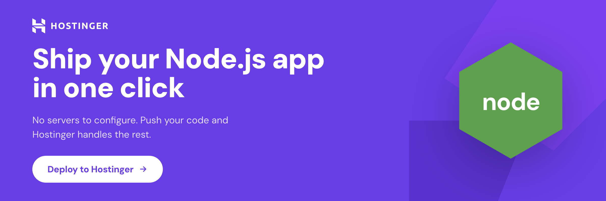

# Cérebro CRM — Template de CRM para WhatsApp

> CRM auto-hospedável para WhatsApp® — caixa de entrada compartilhada,
> contatos, funis de vendas, disparos em massa e automações no-code.
> Faça um fork, personalize a marca, hospede.

<p align="center">
  <a href="https://www.hostinger.com/web-apps-hosting">
    
  </a>
</p>

[](./LICENSE)
[](https://github.com/advmoacirmariz-blip/crm-aberto/actions/workflows/ci.yml)
[](https://nextjs.org)
[](https://supabase.com)
[](https://github.com/advmoacirmariz-blip/crm-aberto/stargazers)

Cérebro CRM é um fork do projeto open source
[wacrm](https://github.com/ArnasDon/wacrm), de Arnas Donauskas,
adaptado e mantido para escritórios de advocacia — faça um fork ou
clone para rodar o seu próprio CRM. Distribuído sob a licença MIT
(veja [LICENSE](./LICENSE)).

## O que você já recebe pronto

- **Caixa de entrada compartilhada** na API oficial do WhatsApp
  Business — vários atendentes trabalhando num único número, atribuição
  por conversa, status e anotações.
- **Contatos + etiquetas + campos personalizados**, importação de CSV,
  deduplicação.
- **Funis de vendas** (Kanban) com negócios vinculados às conversas.
- **Disparos em massa** com templates aprovados pela Meta, rastreio de
  entrega e leitura, substituição de variáveis por destinatário.
- **Automações no-code** — gatilhos em mensagens recebidas, novos
  contatos, palavras-chave ou agendamento; ramificações condicionais,
  esperas, etiquetas, webhooks. Construtor visual.
- **Assistente de resposta com IA** — use sua própria chave OpenAI ou
  Anthropic (armazenada criptografada; sem taxa por assento, seus dados
  continuam seus). Respostas com IA de um clique na caixa de entrada,
  além de um bot de resposta automática opcional com limite por
  conversa e transferência limpa para humano. Adicione uma **base de
  conhecimento** (FAQs, políticas, documentos do produto) e ele responde
  com base no seu próprio conteúdo — busca híbrida (full-text do
  Postgres, ou semântica via pgvector quando uma chave de embeddings é
  configurada).
- **Painel em tempo real** — tempos de resposta, volume diário, valor
  do funil, feed de atividade entre módulos.
- **Contas de equipe** — convide colegas por link, acesso por papel
  (dono / admin / atendente / visualizador), transferência de
  titularidade. Cada instalação é isolada por conta, então uma única
  caixa de entrada compartilhada pode ser operada por uma equipe
  inteira. Uso individual continua sendo single-user, sem configuração
  extra.
- **Gestão de conta** — e-mail, senha, avatar, logout global.
- **API REST pública** (`/api/v1`) com chaves de API com escopo e
  revogáveis — construa suas próprias automações em cima do seu CRM.
  Veja [docs/public-api.md](./docs/public-api.md).
- **Servidor MCP** — controle seu CRM a partir do Claude, Cursor e
  outros assistentes de IA via [Model Context Protocol](https://modelcontextprotocol.io).
  Somente leitura por padrão, escrita opcional. Veja
  [docs/mcp.md](./docs/mcp.md) (servidor em [`mcp-server/`](./mcp-server)).

## Por que fazer um fork disso?

Isto é um **template**, não um produto. Fazer um fork significa que
você tem:

- **Posse total** — seu código, seu projeto Supabase, seu domínio, seus
  dados. Sem lock-in de SaaS, sem cobrança por assento, sem depender de
  confiar em terceiros.
- **Customização total** — adicione os campos que sua equipe precisa,
  remova os módulos que não usa, redesenhe o que quiser. O stack é
  propositalmente "chato" (Next.js + Supabase + Tailwind), então a
  curva de aprendizado é curta.
- **Zero operação para começar** — a [Hostinger](https://www.hostinger.com/web-apps-hosting)
  Managed Node.js publica um fork em poucos cliques. Sem Docker, sem
  Kubernetes, sem precisar de time de infra.
  ([Veja abaixo ↓](#-deploy-na-hostinger-recomendado))
- **Segurança de verdade** — criptografia de tokens (AES-256-GCM), RLS
  em todas as tabelas, webhooks verificados por HMAC, CSP, rate
  limiting, typecheck/build no CI a cada PR.

Não é um framework. Não é um SDK. É um CRM concreto e funcional que
você coloca no ar numa tarde e transforma no seu.

## Começando rápido

```bash
# Primeiro faça um fork no GitHub: https://github.com/advmoacirmariz-blip/crm-aberto → Fork
git clone https://github.com/<seu-usuario>/crm-aberto.git
cd crm-aberto
npm install
cp .env.local.example .env.local   # preencha as credenciais do Supabase + Meta
npm run dev
```

Abra <http://localhost:3000>. Você será redirecionado para `/login`
(ou `/dashboard`, se já estiver logado).

## 🚀 Deploy na Hostinger (recomendado)

<p align="center">
  <a href="https://www.hostinger.com/web-apps-hosting">
    
  </a>
</p>
<p align="center">
  <a href="https://wacrm.tech/docs/deployment-hostinger">
    
  </a>
</p>

**O Cérebro CRM é feito para rodar na [Hostinger](https://www.hostinger.com/web-apps-hosting).**
É o caminho que testamos, documentamos e recomendamos — e a forma mais
rápida de colocar um CRM em nível de produção no ar sem precisar de
uma VPS ou de um cluster Kubernetes.

### Por que Hostinger?

| | |
|---|---|
| **Deploy via Git com um clique** | Conecte seu fork, dê push na `main`, a Hostinger builda e publica. Sem SSH, sem Docker, sem CI para configurar — a própria `main` deste repositório faz deploy assim. |
| **Node.js gerenciado** | Next.js 16 (App Router, server actions, ISR) roda pronto nos planos compartilhados [Premium, Business e Cloud](https://www.hostinger.com/web-apps-hosting). Você não gerencia versão do Node, processos ou proxy reverso. |
| **SSL grátis + domínio grátis** | Let's Encrypt automático no seu domínio próprio (ou um grátis incluso nos planos anuais). HTTPS ligado por padrão — obrigatório para o webhook do WhatsApp Business. |
| **CDN global + LiteSpeed** | Assets estáticos em cache na borda, rotas dinâmicas servidas pelo LiteSpeed. Painéis rápidos de fábrica, sem precisar configurar Cloudflare. |
| **Variáveis de ambiente e logs no hPanel** | Configure `SUPABASE_*`, `WHATSAPP_*` e `ENCRYPTION_KEY` pelo painel — sem `.env` no servidor. Logs da aplicação ao vivo na mesma interface. |
| **Proteção contra DDoS + backups diários** | Incluído, sem complementos. O endpoint do webhook é um alvo público — ter proteção na borda importa. |
| **Mais barato que uma VPS** | Planos a partir de poucos dólares por mês — uma ordem de grandeza mais barato que um host Node.js gerenciado comparável, e você não paga a mais pelo banco de dados (isso é o Supabase). |
| **Suporte humano 24/7** | Chat ao vivo em mais de 20 idiomas — útil quando seu CRM é a ferramenta que sua equipe usa para falar com clientes. |

### A versão de 60 segundos

1. **Faça um fork** deste repositório no GitHub.
2. No **hPanel → Sites → Criar**, escolha **Node.js** e conecte seu
   fork.
3. Cole suas variáveis do Supabase + Meta no hPanel.
4. Dê push na `main`. A Hostinger builda e publica. Pronto.

Passo a passo completo com capturas de tela:
**[wacrm.tech/docs/deployment-hostinger](https://wacrm.tech/docs/deployment-hostinger)**.

> _Nota: o Cérebro CRM é licenciado sob MIT e roda em qualquer lugar
> onde Node.js roda (Vercel, Railway, sua própria VPS). Hostinger é
> recomendado, não obrigatório._

## Documentação

**Nunca implantou um sistema sozinho? Comece pelo**
**[guia de implantação passo a passo](./docs/tutoriais/00-comece-aqui.md)**
**— escrito para quem não é da área técnica**, cobrindo GitHub,
Supabase, WhatsApp Business (Meta) e Hostinger, um de cada vez, até o
CRM estar de fato no ar e recebendo mensagens.

A documentação própria deste repositório está em [`docs/`](./docs) —
importação/exportação de automações, o servidor MCP, a API pública e
os invariantes arquiteturais conhecidos.

Como o Cérebro CRM compartilha a base do projeto original
[wacrm](https://github.com/ArnasDon/wacrm), os guias gerais de
auto-hospedagem dele (configuração do Supabase, configuração da API do
WhatsApp Business, deploy) em boa parte continuam válidos aqui também:
[wacrm.tech/docs](https://wacrm.tech/docs)
(fonte: [ArnasDon/wacrm-site](https://github.com/ArnasDon/wacrm-site)).

Páginas principais do projeto original:
- [Primeiros passos](https://wacrm.tech/docs/getting-started)
- [Configuração do Supabase](https://wacrm.tech/docs/supabase-setup)
- [Configuração do WhatsApp](https://wacrm.tech/docs/whatsapp-setup)
- [Variáveis de ambiente](https://wacrm.tech/docs/environment-variables)
- [Deploy na Hostinger](https://wacrm.tech/docs/deployment-hostinger)
- [Arquitetura](https://wacrm.tech/docs/architecture)
- [Solução de problemas](https://wacrm.tech/docs/troubleshooting)

## Stack

- **App** — Next.js 16 (App Router), React 19, TypeScript, Tailwind v4.
- **Dados** — Supabase (Postgres + Auth + Storage + RLS).
- **WhatsApp** — Meta Cloud API (API oficial do WhatsApp Business).

## Contribuindo

Isto é um template, não um produto colaborativo — o fluxo esperado é
fork → customizar → publicar, **não** contribuição para este
repositório. Relatos de bugs e problemas de segurança são bem-vindos;
PRs de novas funcionalidades geralmente pertencem ao seu próprio fork.
Detalhes em [`CONTRIBUTING.md`](./CONTRIBUTING.md) e
[`.github/SECURITY.md`](./.github/SECURITY.md).

## Créditos

O Cérebro CRM é um fork do **[wacrm](https://github.com/ArnasDon/wacrm)**,
um template de CRM para WhatsApp open source e auto-hospedável, criado
e mantido por **[Arnas Donauskas](https://github.com/ArnasDon)**. O
site e a documentação hospedada do projeto original ficam em
[wacrm.tech](https://wacrm.tech), com o código-fonte em
[ArnasDon/wacrm-site](https://github.com/ArnasDon/wacrm-site).

Toda a arquitetura principal — a base em Next.js/Supabase/API do
WhatsApp Business, a caixa de entrada, os funis, os disparos em massa e
o motor de automações — vem daquele projeto original. Este fork
constrói em cima dela com mudanças voltadas a escritórios de advocacia
brasileiros (marca Cérebro CRM, categorias genéricas de área de
atuação jurídica, um servidor MCP e a documentação própria deste fork
em [`docs/`](./docs)), e é distribuído sob a mesma
[licença MIT](./LICENSE), que exige manter o aviso de copyright
original — veja [LICENSE](./LICENSE) para o texto completo.

Se você está construindo seu próprio CRM e não precisa das adaptações
para advocacia, considere partir direto do projeto original
[ArnasDon/wacrm](https://github.com/ArnasDon/wacrm).

## Licença

[MIT](./LICENSE). Faça um fork, personalize a marca, hospede.
